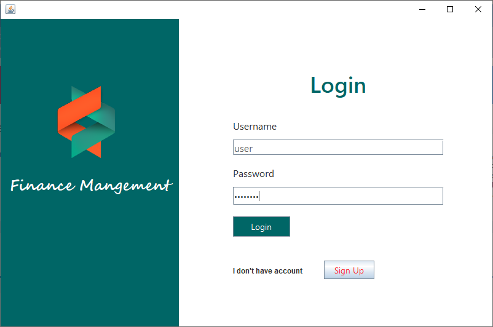
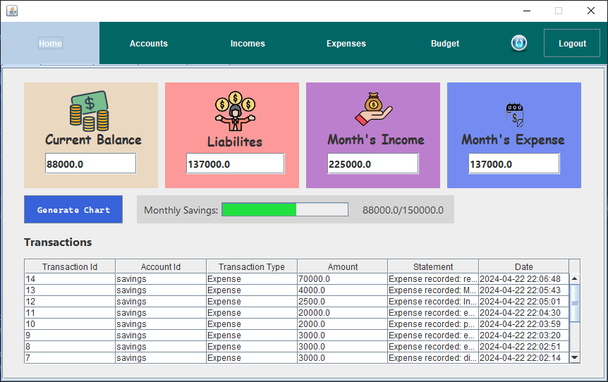
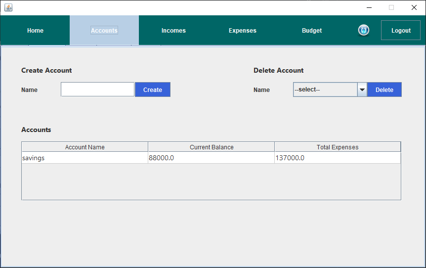
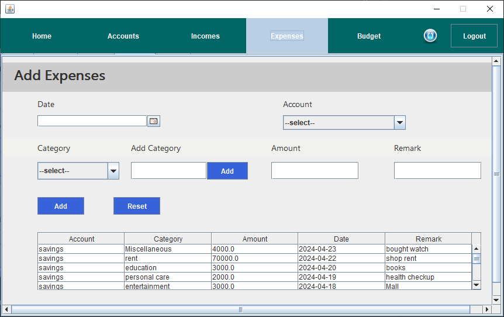
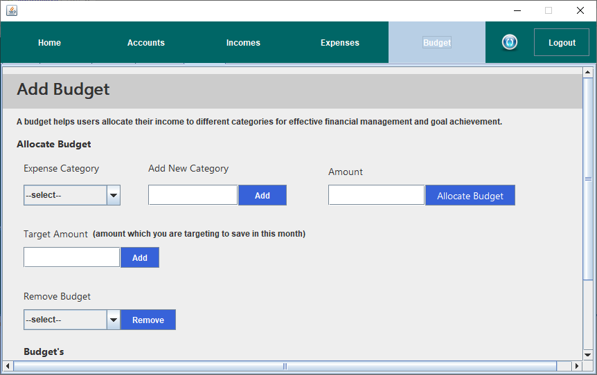

# 💰 Personal Finance Management System

A **Java Swing desktop application** for managing personal finances. This system allows users to track income, expenses, savings goals, and visualize financial data using interactive charts. The application uses **MySQL** for persistent data storage and provides a user-friendly interface for efficient financial management.

---

# 🚀 Features

* 🔐 User Authentication (Login & Signup)
* 💳 Account Management
* 📈 Income Tracking
* 📉 Expense Tracking
* 🎯 Monthly Savings Target
* 📊 Interactive Charts & Analytics
* 🧾 Transaction History
* 📅 Date-based Financial Records
* 🏠 Dashboard Overview
* 🗄 MySQL Database Integration

---

# 🛠 Tech Stack

**Frontend:** Java Swing
**Backend:** Core Java
**Database:** MySQL
**IDE:** Apache NetBeans / IntelliJ IDEA
**Database Connectivity:** JDBC

---

# 📚 Libraries Used

* MySQL Connector (JDBC)
* JCalendar (Date Picker)
* XChart (Charts & Graphs)
* AbsoluteLayout (UI Layout)

---

# 📂 Project Structure

```
src/
 ├── Chart/
 │    └── IncomeExpenseChart.java
 │
 ├── Database/
 │    ├── DatabaseManager.java
 │    └── UserSession.java
 │
 ├── Home/
 │    ├── HomePage.java
 │    └── HomePage.form
 │
 ├── Login/
 │    ├── Login.java
 │    ├── Login.form
 │    ├── SignUp.java
 │    └── SignUp.form
 │
 └── personalfinancemanagement/
      └── PersonalFinanceManagement.java
```

---

# 📸 Screenshots

### 🔐 Login



### 📝 Signup


### 🏠 Dashboard



### 💳 Accounts



### 📈 Income


### 📉 Expense



### 🎯 Budget



---

# ⚙️ Installation & Setup

### 1. Clone Repository

```
git clone https://github.com/sujal-09/personal-finance-management.git
```

### 2. Open Project

Open project in:

* Apache NetBeans
  OR
* IntelliJ IDEA

### 3. Setup Database

* Install MySQL
* Create database
* Import SQL file from:

```
Database_Setup/
```

### 4. Configure Database

Update credentials inside:

```
DatabaseManager.java
```

Example:

```
String url = "jdbc:mysql://localhost:3306/finance_db";
String user = "root";
String password = "your_password";
```

### 5. Run Project

Run:

```
PersonalFinanceManagement.java
```

---

# 🎯 Use Case

This project helps users:

* Track daily expenses
* Monitor income
* Set savings goals
* Visualize financial habits
* Manage multiple accounts
* Analyze monthly spending

---

# 👨‍💻 Author

**Sujal Chouksey**
GitHub: https://github.com/sujal-09

---

# ⭐ If you like this project

Give it a ⭐ on GitHub and feel free to contribute!
